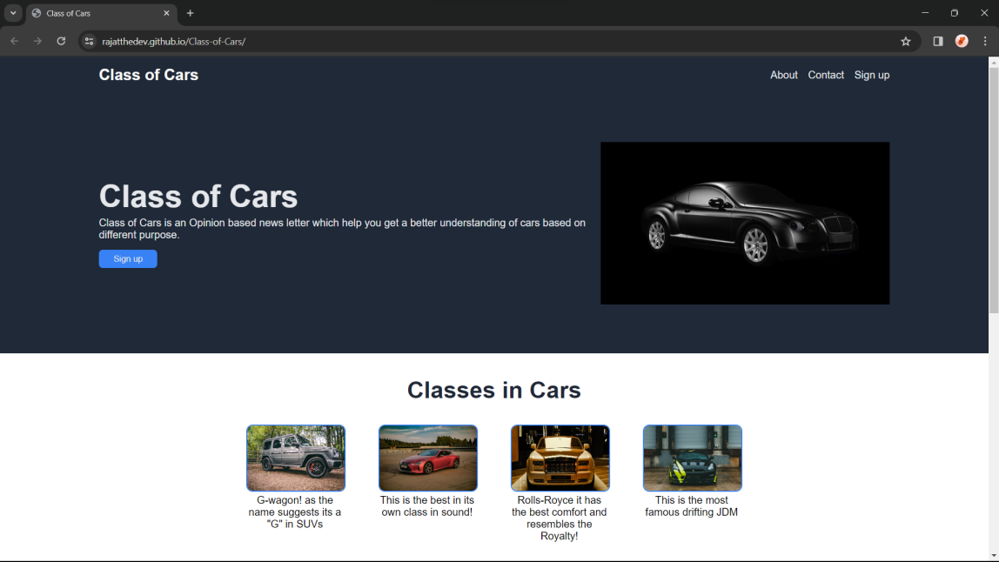
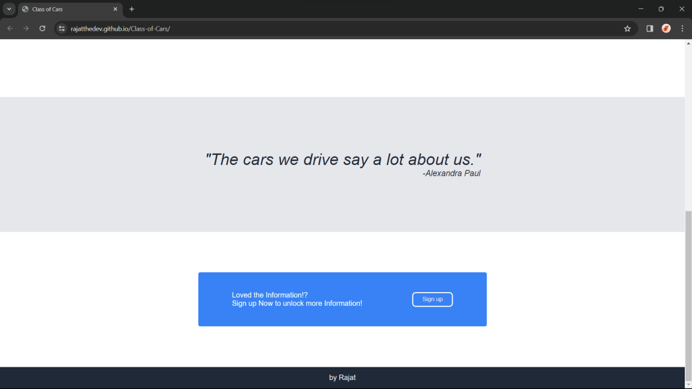

# Class Of Cars Project

## Introduction

This project is part of The Odin Project's curriculum. In this project we have to demonstrate our learning of Flexbox, HTML, CSS by applying them and making a project from scratch.

## Technologies used

Technologies used in this project:

  - HTML
  - CSS
  - Git

## Skills Demonstrated

While completing this project we have demonstrated the following skills:

  - **Git Workflow:** The using of git commands like push, commit, add, etc.
  - **Flexbox:** We use flexbox concept in almost every website while developing them. While creating the website we get one screenshot to apply our learning and develop a project on our own imagination.
  - **CSS styles:** Use of CSS Foundations basic styling of website, which gives us a better view of how CSS can make a simple webpage look so good.
  - **HTML Foundations:** Use of HTML Foundations learning in structuring the website.

## UI Preview

## Getting Started

To get started with the project, follow the steps:

  1. Clone the repository: `git clone git@github.com:RajatTheDev/Class-of-Cars.git`
  2. Click on the `index.html` file to get started.
  3. Customise the webpage by clicking on the `styles.css`.

## Usage

Feel free to customise the project as per your preferences and create your favourite Classes of Cars!

## License

This project is licensed under the [MIT License](LICENSE), allowing for collaboration and sharing.